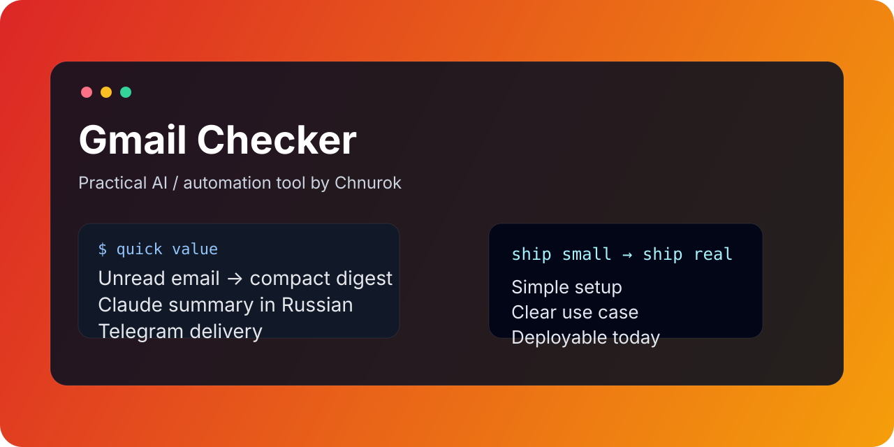

# Gmail Checker



A small utility that watches a Gmail inbox, summarizes unread messages with Claude, and delivers the result to Telegram.

## Why use it

Useful when you want a lightweight inbox monitor without living inside a full mail client or building a heavyweight automation stack.

## Highlights

- 📧 connects to Gmail over IMAP
- 📨 reads unread messages from the inbox
- ✍️ builds a compact Russian summary with Claude
- 🤖 sends the digest to Telegram
- ⚙️ easy environment-variable setup
- 🧩 runs well manually, via cron, systemd, or another automation layer

## Quick start

```bash
git clone https://github.com/Chnurok/gmail-checker.git
cd gmail-checker
python3 -m venv .venv
source .venv/bin/activate
pip install -r requirements.txt
cp .env.example .env
python3 run.py
```

## Configuration

```bash
GMAIL_USER=your@gmail.com
GMAIL_APP_PASSWORD=your_gmail_app_password
TELEGRAM_BOT_TOKEN=your_bot_token
TELEGRAM_CHAT_ID=your_chat_id
ANTHROPIC_API_KEY=your_anthropic_key
STATE_FILE=./state.json
```

## How it works

1. logs into Gmail over IMAP
2. finds unread messages
3. extracts sender, subject, and text snippets
4. asks Claude for a short summary in Russian
5. sends the summary to Telegram

## Example output

```text
📧 Почта your@gmail.com
4 новых письма

- срочное: письмо от клиента по срокам
- важно: подтверждение оплаты
- не срочно: рассылка сервиса
- спам: рекламное предложение
```

## Good fit for

- daily inbox digests
- monitoring a secondary mailbox
- Telegram-first personal assistant workflows
- scheduled checks via cron or OpenClaw-triggered runs

## Security notes

- do **not** commit real credentials
- use environment variables or a secret file outside version control
- Gmail App Passwords should be treated like full mailbox credentials

## License

MIT
